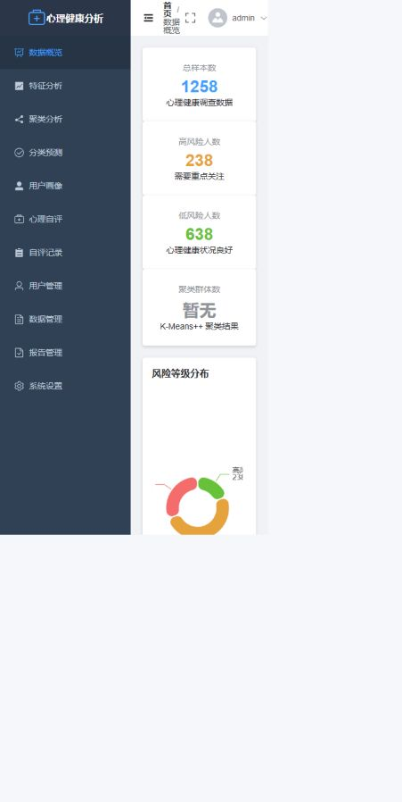
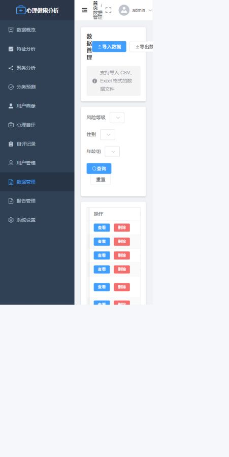
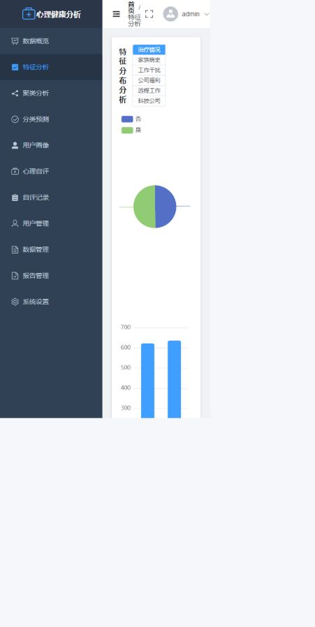
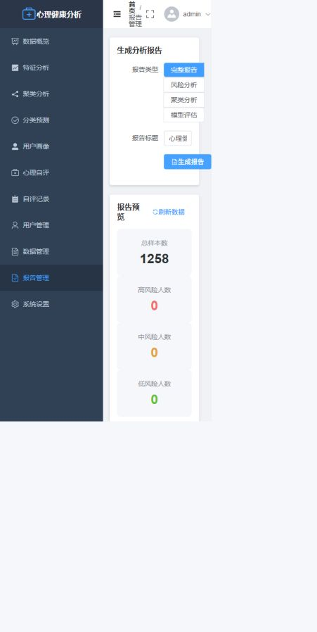
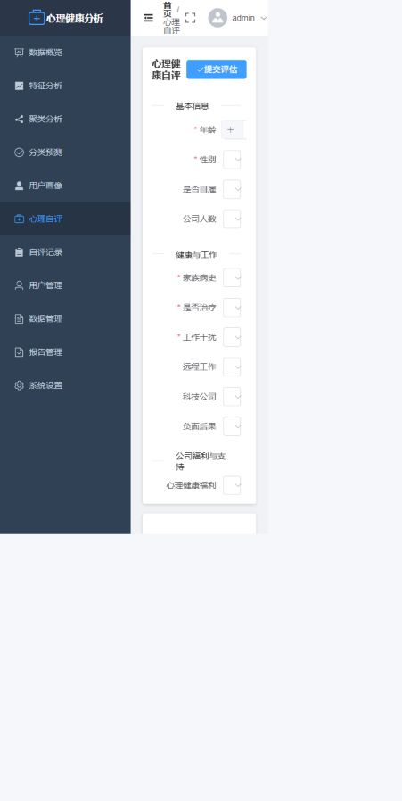

# 心理健康数据分析与用户画像系统

基于 Flask、Vue 3 和 scikit-learn 的心理调查数据分析系统，覆盖数据导入、清洗、
聚类、分类、用户画像、可视化和 PDF 报告。

项目包含服务端 RBAC、普通用户数据隔离、CSV/Excel 导入、报告所有权控制以及
Python API 测试，适合作为校招或个人作品项目继续迭代。

## 功能

- JWT 登录、refreshtoken 和 bcrypt 密码哈希
- `admin`、`analyst`、`user` 三类角色及服务端权限校验
- CSV、XLSX、XLS 数据导入，字段映射和批量入库
- 数据清洗、分页筛选、统计分布和 CSV 导出
- KMeans++ 聚类、RandomForest 分类和模型指标持久化
- 用户画像、风险评分、标签和干预建议
- 9 类 ECharts 可视化图表
- 完整报告和个人报告 PDF 输出
- 报告列表及下载按用户隔离

## 权限模型

| 功能 | admin | analyst | user |
|---|---:|---:|---:|
| 数据导入、删除、导出 | 是 | 是 | 否 |
| 运行分析和训练模型 | 是 | 是 | 否 |
| 查看全局画像和可视化 | 是 | 是 | 否 |
| 生成完整分析报告 | 是 | 是 | 否 |
| 生成个人评估报告 | 是 | 是 | 是 |
| 查看本人自评 | 是 | 是 | 是 |
| 查看所有自评记录 | 是 | 是 | 否 |
| 管理用户账号 | 是 | 只读 | 否 |

公开注册固定创建 `user` 角色。`admin` 和 `analyst` 账号需要通过
`init_db.py`、数据库或后续管理员功能创建。

## 技术栈

- 后端：Python 3.10、Flask、SQLAlchemy、Flask-JWT-Extended
- 数据库：MySQL 8；开发和演示也可使用 SQLite
- 数据处理：Pandas、NumPy、scikit-learn
- 前端：Vue 3、Vite、Element Plus、Pinia、ECharts
- 报告：ReportLab
- 测试：pytest、pytest-flask

## 项目结构

```text
psychological/
├── docs/screenshots/                 # 演示截图
├── mentally/mentally/
│   ├── backend/
│   │   ├── app/
│   │   │   ├── api/                 # 认证、数据、分析、画像、报告 API
│   │   │   ├── ml/                  # 特征工程、聚类和分类
│   │   │   ├── models/              # SQLAlchemy 模型
│   │   │   ├── services/            # 业务服务层
│   │   │   └── utils/permissions.py # 服务端权限装饰器
│   │   ├── tests/                   # API 与权限测试
│   │   ├── init_db.py               # 数据库初始化脚本
│   │   └── requirements.txt
│   └── frontend/                    # Vue 3 前端
└── README.md
```

## 快速启动

### 1. 启动后端

在 `mentally/mentally/backend` 目录执行：

```powershell
python -m venv .venv
.\.venv\Scripts\Activate.ps1
pip install -r requirements.txt
Copy-Item .env.example .env
```

使用 MySQL 时，修改 `.env` 中的连接信息后执行：

```powershell
python init_db.py --with-demo-data
python run.py
```

不安装 MySQL 也可以使用 SQLite 快速演示：

```powershell
$env:DATABASE_URL="sqlite:///demo.db"
python init_db.py --with-demo-data
python run.py
```

后端默认地址为 `http://localhost:5000`。

### 2. 启动前端

在 `mentally/mentally/frontend` 目录执行：

```powershell
npm install
npm run dev
```

前端默认地址为 `http://localhost:3000`，开发服务器会把 `/api` 代理到
`http://localhost:5000`。

### 3. 演示账号

执行 `init_db.py` 后默认创建：

| 用户名 | 密码 | 角色 |
|---|---|---|
| `admin` | `Admin123!` | admin |
| `analyst` | `Analyst123!` | analyst |

演示密码可通过 `ADMIN_PASSWORD` 和 `ANALYST_PASSWORD` 环境变量覆盖。

## 数据库初始化

```powershell
# 只建表，不创建账号
python init_db.py --skip-accounts

# 建表、创建管理员和分析师
python init_db.py

# 建表、创建账号并导入 survey.csv
python init_db.py --with-demo-data
```

`DATABASE_URL` 存在时优先使用它，否则使用 `.env` 中的 MySQL 配置。

## 测试与构建

后端：

```powershell
cd mentally/mentally/backend
.\.venv\Scripts\python.exe -m pytest -q
```

当前测试覆盖：

- 客户端伪造 `role` 时仍注册为普通用户
- 普通用户访问数据、分析、画像、报告和管理接口时返回 `403`
- 看板、分析师访问和数据上传
- CSV、XLSX 导入
- 报告列表和下载归属隔离
- 普通用户不能查看他人的自评记录

前端：

```powershell
cd mentally/mentally/frontend
npm run build
```

`requirements.txt` 只包含核心运行依赖。PySpark、Kafka、HDFS 等未启用依赖位于
`requirements-optional.txt`，需要对应功能时再安装。

## 演示截图

### 登录界面


### 数据概览



### 数据管理



### 特征分析



### 报告管理



### 心理自评



## 接口约定

除登录和注册外，接口统一需要：

```http
Authorization: Bearer <access_token>
```

响应结构：

```json
{
  "code": 200,
  "message": "操作成功",
  "data": {}
}
```

常用错误码：

- `400`：请求参数错误
- `401`：未登录、Token 无效或账号被禁用
- `403`：已登录但无权限
- `404`：资源不存在
- `500`：服务器内部错误
